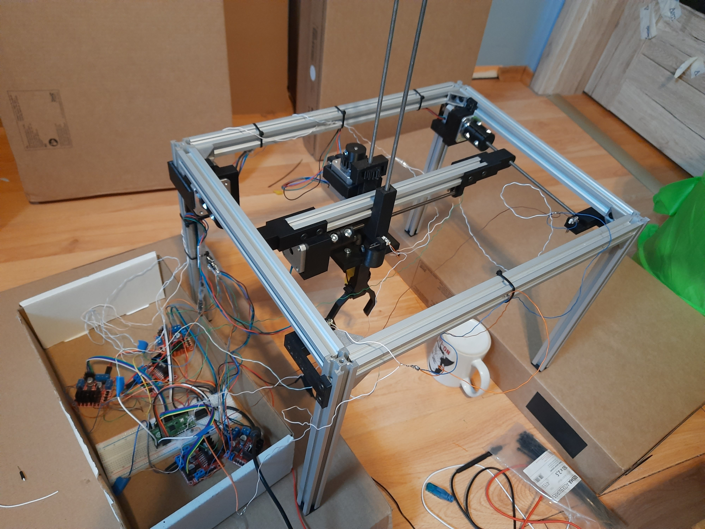
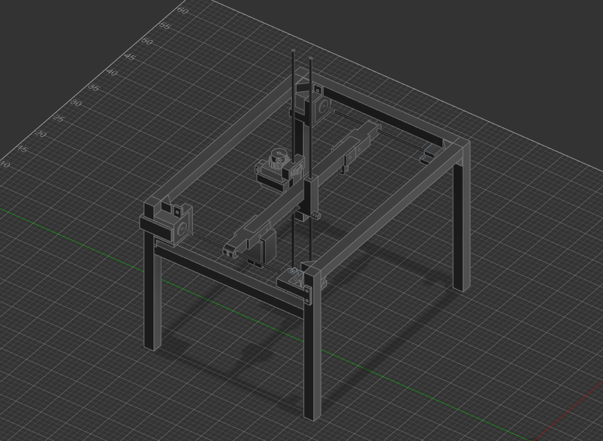

# Cartessian robot

  

CR is robotic "arm" designed to move a small object from point A to B.
It can move in all 3 dimensions, at variable speeds.
3 endstop switches allow it to automatically calibrate, just like many FDM 3D printers.

  

### Bill of materials:

* RPI pico
* 4 x L298N (motor controller)
* 3 x JK42HS40-1684 (stepper motor)
* 3 x endstop switch
* 7 x 30 cm 20x20 V-slot
* 2 x 40 cm 20x20 V-slot
* 3 x 20 cm M5 threaded rod
* 2 x 35+ cm M5 threaded rod
* ~25 M5 screws

